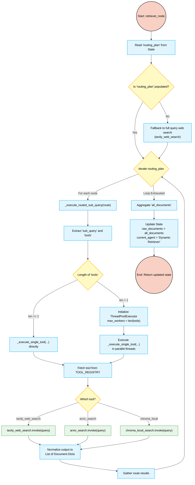

# Autonomous Multi-Agent Research Assistant -- Agents Guide

## The Agent Topology
The system utilizes a sequential DAG (Directed Acyclic Graph) orchestrated by LangGraph, where the `ResearchState` object traverses a pipeline of specialized nodes. By compartmentalizing tasks to these single-responsibility agents, the pipeline achieves much higher precision and reliability over generic ReAct logic.

The strict execution order is:
`Planner` → `Retriever` → `Analyst` → `Insight Generator` → `Reporter`

---

## Agent Implementations

### 1. Planner (`planner.py`)
**Role:** The Triage Nurse  
**Execution Context:** Entry Point  
**Responsibilities:** 
- **Decomposition**: Intercepts the user query and decomposes it dynamically into 2-4 sub-queries to maximize coverage.
- **Deterministic Routing**: Decides which `tools` handle which queries (e.g., `tavily_web_search` for news, `arxiv_search` + `chroma_local` for academic theories) based entirely on a prompt-engineered Decision Matrix.
- **JSON Serialization**: Outputs a structured `SubQueryRoute` dictionary mapping the plan.

### 2. Retriever (`retriever.py`)
**Role:** The Pharmacist  
**Execution Context:** Fetch Mechanism  
**Responsibilities:**
- Reads the literal prescription from the Planner without questioning it.
- Initiates `ThreadPoolExecutor` parallel threads, drastically cutting down total retrieval latency when fetching across multiple databases/engines.
- Normalizes downstream output formatting mapping Document chunks, ensuring source traceability for future analysis.

#### Retriever Flow Logic:

### 3. Analyst (`analyst.py`)
**Role:** The Skeptic (PolitiFact / Peer Reviewer)  
**Execution Context:** Verification Stage  
**Responsibilities:**
- Sifts out hallucinated or poorly structured retrieval documents.
- Evaluates provenance heuristics: labels source materials by credibility (e.g. Papers vs. Blogs vs. Tweets).
- Structurally forces the discovery of contradictions. It will actively flag when "Source A claims X, but Source B claims Y."

### 4. Insight Generator (`insight.py`)
**Role:** The Senior Strategy Partner  
**Execution Context:** Synthesis Engine  
**Responsibilities:**
- Receives purely verified logic from the Analyst.
- Executes **Explicit Chain-of-Thought (CoT)** reasoning strings, formulating logical "Observation -> Consequence -> Hypothesis" leaps.
- Identifies missing gaps and frames future strategic implications. Ensures no hypothesis is disguised as a verified fact.

### 5. Reporter (`reporter.py`)
**Role:** The McKinsey Reporting Editor  
**Execution Context:** Exit Point  
**Responsibilities:**
- Renders the finalized intelligence into standard structural markdown blocks.
- Forces absolutely uncompromising, accurate citations (using direct ArXiv URLs/Titles verbatim to avoid generic `[1] ArXiv Research Paper` hallucinated traps).
- Logs and instruments an execution latency footer appending temporal metadata.
